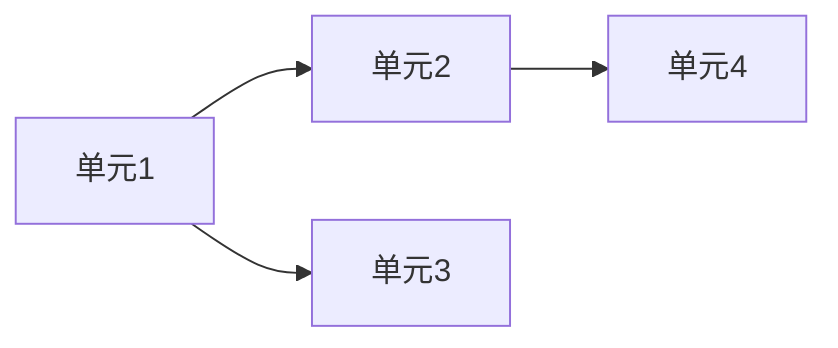

# Split Requirements into Implementable Units

## Goal

Turn a vague or large requirement into **small units** that each can be:
- Implemented in one focused session (typically 1–4 hours)
- Verified independently
- Merged without blocking unrelated work

Do **not** start coding until the user confirms the breakdown (unless they explicitly ask to implement immediately).

## Workflow

### Step 1: Clarify the requirement

Extract and state briefly:

| Field | Question |
|-------|----------|
| **Goal** | What user/problem outcome? |
| **Scope** | What is in / out? |
| **Constraints** | Tech stack, no config change, deadline, existing APIs |
| **Success** | How do we know it works? |

If critical info is missing, ask **at most 2** focused questions before proposing a breakdown.

### Step 2: Choose decomposition strategy

Pick the primary strategy (state which one you used):

| Strategy | When to use |
|----------|-------------|
| **Vertical slice** | End-to-end user flow (UI → API → DB) per thin feature |
| **Layer slice** | Shared infra first (schema, client, service) then consumers |
| **Risk-first** | Spike unknowns (POC, integration test) before main work |
| **Pipeline stage** | Data flows (ingest → transform → index → retrieve) |

Prefer **vertical slices** for user-facing features; use **layer slice** only when multiple features share one foundation.

### Step 3: Apply unit sizing rules

Each unit must pass **SMART-C**:

- **S**mall — One concern; diff ideally < 200 lines
- **M**easurable — Has testable acceptance criteria
- **A**utonomous — Can be done without unfinished sibling units (or dependency is explicit)
- **R**eversible — Easy to roll back or feature-flag
- **T**estable — Clear how to verify (API call, UI click, unit test)
- **C**onstrained — Respects user constraints (e.g. "don't touch .env")

**Too big** → split. **Too small** (rename variable) → merge into parent unit.

### Step 4: Output the breakdown

Use this template:

```markdown
# [Feature name] — 实施拆解

## 目标
[One sentence]

## 范围
- 包含：…
- 不包含：…

## 依赖关系


## 实施单元

### 单元 1：[短标题]
- **类型**：vertical | infra | spike | refactor
- **改动范围**：文件/模块（预估）
- **依赖**：无 | 单元 N
- **验收标准**：
  - [ ] …
  - [ ] …
- **验证方式**：curl / 手动步骤 / 测试命令
- **预估**：S | M | L（S≤2h, M≤4h, L需再拆）

### 单元 2：…

## 推荐执行顺序
1. 单元 … — 原因
2. 单元 …

## 风险与待决
- …
```

### Step 5: Offer next action

End with one line:
- 「按此顺序从单元 1 开始实现？」或
- 「需要把某个单元再拆细吗？」

## Unit types (tag every unit)

| Tag | Meaning |
|-----|---------|
| `spike` | Research / POC; may throw away |
| `infra` | DB, docker, client, shared types |
| `api` | Controller, service, DTO |
| `ui` | Frontend component / page |
| `integration` | Wire layers together |
| `observability` | Logs, metrics, debug endpoint |
| `docs` | README, API doc only |

## Anti-patterns

| Bad unit | Fix |
|----------|-----|
| "完成混合检索" | Split: client → retriever → fusion → API → chat wire |
| "优化性能" | Name metric + change: async classify, parallel prefetch |
| "加测试" | Per-unit tests attached to the unit they verify |
| "改前端和后端" | Two units unless truly atomic |

## Agent rules

1. Read relevant code before breaking down — align units with existing modules.
2. Map units to **existing directories** (`end/src/...`, `front/src/...`).
3. Do not add units for unrequested scope (no drive-by refactors).
4. If requirement is already small enough, say so and give **one** unit with criteria.
5. For bugs: units = reproduce → fix → regression test.

## Additional resources

- MemBot-style examples: [examples.md](examples.md)
