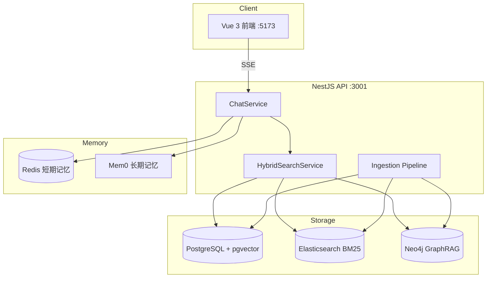

# MemBot

基于 RAG 的智能问答助手：支持有道云笔记同步、文档上传、三路混合检索，并结合 Redis 短期记忆与 Mem0 长期记忆。

## 功能概览

- **流式对话**：LangChain Agent + OpenRouter 大模型，SSE 流式输出
- **短期记忆**：Redis 存储当前会话上下文，支持自动摘要（TTL 30 分钟）
- **长期记忆**：Mem0 用户层/会话层分层记忆，支持 8 类细分类别（身份、偏好、项目、学习、任务、反馈、知识库使用、决策）
- **知识库入库**：有道笔记同步、文件上传 → 清洗 → 分块 → 向量化 → pgvector
- **三路混合检索**：pgvector 向量 + Elasticsearch BM25 + Neo4j GraphRAG，RRF 融合
- **可观测性**：LangSmith 链路追踪（可选）

## 记忆机制

### 短期记忆（Redis）
- 当前会话上下文，TTL 30 分钟
- 支持 LangGraph 自动摘要（8 条消息触发）

### 长期记忆（Mem0）
- **用户层**：跨会话长期事实（身份、偏好、项目、学习等）
- **会话层**：当前会话任务、进度、临时决策
- **细分类别**：identity / preference / project / learning / task / feedback / knowledge_usage / decision
- 分类器自动判断是否写入及分类层级

## 架构



## 技术栈

| 层级 | 技术 |
|------|------|
| 前端 | Vue 3、Vite、TailwindCSS |
| 后端 | NestJS、TypeScript |
| 对话 | LangChain、LangGraph、OpenRouter |
| 记忆 | Redis、Mem0 |
| 向量库 | PostgreSQL + pgvector |
| 全文检索 | Elasticsearch 8.15 |
| 图谱检索 | Neo4j 5.26 |
| 任务队列 | BullMQ + Redis |
| 追踪 | LangSmith（可选） |

## 快速开始

### 1. 启动基础设施

```bash
docker compose up -d
```

| 服务 | 地址 | 说明 |
|------|------|------|
| Redis | `localhost:6379` | 短期记忆、任务队列 |
| RedisInsight | `http://localhost:5540` | Redis GUI |
| PostgreSQL | `localhost:5432` | 用户 `membot` / 密码 `membot` |
| pgAdmin | `http://localhost:5050` | 邮箱 `admin@membot.com` / 密码 `membot` |
| Elasticsearch | `http://localhost:9200` | BM25 检索 |
| Neo4j Browser | `http://localhost:7474` | 用户 `neo4j` / 密码 `membot123` |

### 2. 配置环境变量

在项目根目录创建 `.env`（参考下方「环境变量」章节），至少配置：

- `OPENROUTER_API_KEY` — 对话与 Embedding
- `MEM0_API_KEY` — 长期记忆（可选）
- `DATABASE_URL` — PostgreSQL 连接串

### 3. 安装依赖并启动

```bash
# 后端
cd end
npm install --legacy-peer-deps
npm run start:dev

# 前端（新终端）
cd front
npm install
npm run dev
```

### 4. 访问

- 前端：`http://localhost:5173`（需先注册/登录）
- API：`http://localhost:3001/api`
- 健康检查：`http://localhost:3001/api/health`

### 5. 登录认证

- 注册：`POST /api/auth/register` `{ "email", "password" }`
- 登录：`POST /api/auth/login`
- 当前用户：`GET /api/auth/me`（需 `Authorization: Bearer <token>`）
- 登录后 `users.id`（UUID）作为全系统 `userId`：会话、知识库、Mem0 长期记忆均按用户隔离
- 未登录无法访问对话、知识库与 Mem0

## 项目结构

```
chat/
├── front/                  # Vue 3 前端
├── end/                    # NestJS 后端
│   └── src/
│       ├── chat/           # 流式对话、Mem0、Redis 记忆
│       ├── knowledge/      # 知识库同步、入库、检索
│       │   ├── ingestion/  # 解析、分块、向量化、队列
│       │   └── retrieval/  # vector / bm25 / graph / RRF
│       ├── sessions/       # 会话管理
│       └── health/         # 健康检查
├── docs/                   # 设计文档
├── docker-compose.yml      # 基础设施
├── .env                    # 环境变量（勿提交密钥）
└── AGENT.md                # Agent 行为说明
```

## 知识库流程

### 数据来源

1. **有道云笔记**：`POST /api/knowledge/youdao/sync`
2. **文件上传**：`POST /api/knowledge/upload`（PDF、Word、Excel、TXT 等）

### 入库流水线

```
解析 → 清洗 → 分块 → Embedding → 写入 pgvector
                              ↓
                    同步 Elasticsearch + Neo4j
```

### 混合检索

对话或 `POST /api/knowledge/search` 时并行执行三路检索，经 RRF 融合后注入 System Prompt：

| 通道 | 存储 | 适用场景 |
|------|------|----------|
| `vector` | pgvector | 语义相似 |
| `bm25` | Elasticsearch | 关键词匹配 |
| `graph` | Neo4j | 实体关联、全文 |

## 主要 API

### 对话

| 方法 | 路径 | 说明 |
|------|------|------|
| `POST` | `/api/sessions/:id/chat/stream` | SSE 流式对话 |

### 会话

| 方法 | 路径 | 说明 |
|------|------|------|
| `GET` | `/api/sessions/history` | 会话列表 |
| `POST` | `/api/sessions` | 创建会话 |

### 知识库

| 方法 | 路径 | 说明 |
|------|------|------|
| `POST` | `/api/knowledge/youdao/sync` | 同步有道笔记 |
| `GET` | `/api/knowledge/youdao/status` | 同步状态 |
| `POST` | `/api/knowledge/upload` | 上传文档 |
| `POST` | `/api/knowledge/search` | 混合检索 |
| `POST` | `/api/knowledge/search/reindex` | 重建 ES/Neo4j 索引 |
| `POST` | `/api/knowledge/ingest/retry` | 重试失败入库 |

### 示例：混合检索

```bash
curl -X POST "http://localhost:3001/api/knowledge/search?userId=demo_user_001" \
  -H "Content-Type: application/json" \
  -d '{"query":"vue","topK":5}'
```

## 环境变量

| 变量 | 说明 | 默认值 |
|------|------|--------|
| `OPENROUTER_API_KEY` | OpenRouter API Key | — |
| `OPENROUTER_MODEL` | 对话模型 | — |
| `MEM0_API_KEY` | Mem0 API Key | — |
| `JWT_SECRET` | JWT 签名密钥 | — |
| `JWT_EXPIRES_SECONDS` | Token 有效期（秒） | `604800`（7 天） |
| `DATABASE_URL` | PostgreSQL 连接串 | — |
| `REDIS_HOST` / `REDIS_PORT` | Redis | `localhost` / `6379` |
| `EMBEDDING_MODEL` | Embedding 模型 | — |
| `EMBEDDING_DIMENSIONS` | 向量维度 | `1536` |
| `ELASTICSEARCH_URL` | ES 地址 | `http://localhost:9200` |
| `NEO4J_URI` | Neo4j Bolt 地址 | `bolt://localhost:7687` |
| `NEO4J_PASSWORD` | Neo4j 密码 | — |
| `SEARCH_TOP_K` | 检索返回条数 | `10` |
| `SEARCH_RRF_K` | RRF 平滑系数 | `60` |
| `LANGCHAIN_TRACING_V2` | 开启 LangSmith | `false` |
| `LANGCHAIN_API_KEY` | LangSmith API Key | — |
| `LANGCHAIN_PROJECT` | LangSmith 项目名 | — |

> 注意：有道笔记同步入库使用的 `userId` 可能与 `MEM0_USER_ID` 不同，检索时需传入正确的 `userId`（如 `demo_user_001`）。

## 性能优化

当前对话链路已做以下代码层优化（无需改配置）：

- Mem0 检索与知识库检索 **并行**执行
- 知识库上下文注入 **截断**（每 chunk 最多 300 字）
- Mem0 记忆分类 **异步**后台执行，不阻塞流式结束
- 记忆分类使用 **轻量模型**，寒暄/短消息 **规则跳过**

## 可观测性

开启 LangSmith 后可在 [smith.langchain.com](https://smith.langchain.com) 查看：

- `LangGraph` — 主对话链路（检索上下文 + LLM 生成）
- `RunnableSequence` — Mem0 记忆分类（后台异步）

流式响应 `meta` 事件包含 `prefetchMs`、`knowledgeHits`、`knowledgeChannels` 等调试字段。

## 常见问题

**Docker 未启动**  
Redis / PostgreSQL / ES / Neo4j 不可用，后端会降级或检索失败。先执行 `docker compose up -d`。

**向量化失败**  
检查 `EMBEDDING_MODEL` 与 `EMBEDDING_DIMENSIONS` 是否匹配；可用 `POST /api/knowledge/ingest/retry` 重试。

**ES 连接失败**  
客户端版本需与 ES 8.15 匹配（`@elastic/elasticsearch@8.15.x`）。

**检索无结果**  
确认文档 `status = indexed`，且 `userId` 与入库时一致；可执行 `POST /api/knowledge/search/reindex?userId=xxx` 重建索引。

## 相关文档

- [知识库向量化入库设计](docs/knowledge-vector-ingestion.md)
- [Agent 行为说明](AGENT.md)

## License

Private
